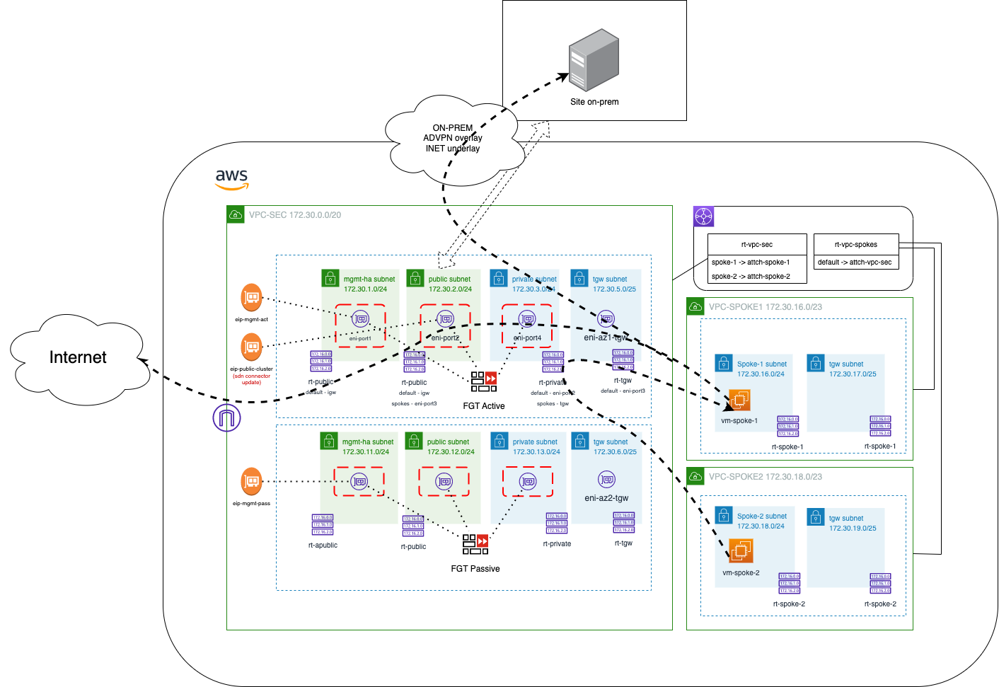

# AWS Transit Gateway scenario with Terraform
## Introduction
This project gives an example of a usual scenario using [AWS Transit Gateway](https://aws.amazon.com/transit-gateway/) product. That component provides a way to interconnect multiple VPCs in a hub-spoke topology.

The Transit Gateway is meant to supersede the more complex and expensive Transit VPC technology. This is a didactic example to showcase how a Transit VPC should be configured to achieve a non-trivial (full mesh) scenario.


## Requirements
* [Terraform](https://learn.hashicorp.com/terraform/getting-started/install.html) >= 1.0.0
* Terraform Provider AWS 3.63.0
* Terraform Provider Template 2.2.0

## Deployment Overview
A Transit Gateway relies on Route Tables. By default, a new Route Table is created in the Transit Gateway (TGW), which populates with the routing info toward every VPC attached to the gateway (the full mesh scenario)
The Terraform code in this project demonstrates how to control N-S and E-W traffic 

* VPC-1(172.30.16.0/23): in the 'Dev' environment - Spoke1 VPC - 2 subnets (2 x 1 Availability Zone)
* VPC-2(172.30.18.0/23): in the 'Dev' environment - Spoke2 VPC - 2 subnets (2 x 1 Availability Zone)
* VPC-3(172.30.0.0/20): in the 'Shared SEC' environment - Mgmt VPC - 8 subnets (4 x 2 Availability Zone)

All traffic goes to the FGT cluster through TGW to the private subnet interface, where firewall policy will control traffic to Internet, between spoke or to on-prem sites. 

To enable such a scenario, two Transit Gateway Route Tables are created.  One Route per sec vpc and other for spokes. 

* RouteTable-1 : associated with all subnets in both Spoke1 and Spoke2 VPC and send all traffic to attachment VPC SEC.
- RouteTable-2 : associated with all subnets in VPC SEC to reach SPOKES through TGW. 

* Spoke1/Spoke2 VPC each gets a t2.micro Ubuntu instance to validate the network connectivity over ssh and ICMP (ping). 


## Diagram solution



## Deployment
* Clone the repository.
* Change ACCESS_KEY and SECRET_KEY values in terraform.tfvars.example.  And rename `terraform.tfvars.example` to `terraform.tfvars`.
* Change parameters in the variables.tf.
* If using SSO, uncomment the token variable in variables.tf and providers.tf
* Initialize the providers and modules:
  ```sh
  $ terraform init
  ```
* Submit the Terraform plan:
  ```sh
  $ terraform plan
  ```
* Verify output.
* Confirm and apply the plan:
  ```sh
  $ terraform apply
  ```
* If output is satisfactory, type `yes`.

Output will include the information necessary to log in to the FortiGate-VM instances:
```sh
Outputs:

FGT_Active_MGMT_Public_IP = <Active FGT Management Public IP>
FGT_Cluster_Public_IP = <Cluster Public IP for ADVPN>
FGT_Passive_MGMT_Public_IP = <Passive FGT Management Public IP>
FGT_Password = <FGT Password>
FGT_Username = <FGT admin>
TestVM_spoke-1-IP = <Spoke-1 test instance ip>
TestVM_spoke-2-IP = <Spoke-2 test instance ip>
```

## Destroy the instance
To destroy the instance, use the command:
```sh
$ terraform destroy
```

# Support
This a personal repository with goal of testing and demo Fortinet solutions on the Cloud. No support is provided and must be used by your own responsability. Cloud Providers will charge for this deployments, please take it in count before proceed.

## License
Based on Fortinet repositories with original [License](https://github.com/fortinet/fortigate-terraform-deploy/blob/master/LICENSE) © Fortinet Technologies. All rights reserved.

